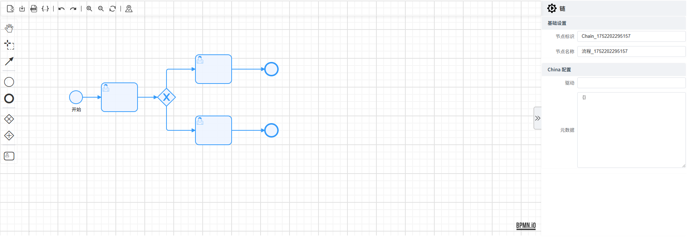
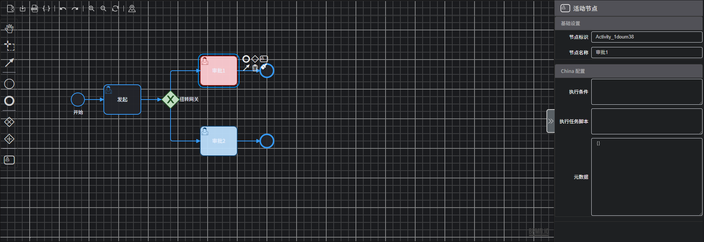

<h1 align="center"><a href="https://solon.noear.org/article/learn-solon-flow" target="_blank">Solon-Flow-Bpmn-Designer</a></h1>
<h4 align="center"><a href='https://gitee.com/iajie/easy-bpmn-designer/stargazers'></a></h4>

<h2 align="center">简易 开源Solon Flow设计器</h2>
<h3 align="center">开箱即用、支持所有前端框架</h4>






## 开始关注并使用 Solon-Flow-Bpmn-Designer

给我们 star，这样，在我们发布新的版本时，您可以及时获得通知。


## 什么是 Solon-Flow-Bpmn-Designer

Solon-Flow-Bpmn-Designer 是一个基于bpmn重新加工的流程设计器，主要适配于Solon-Flow使用，它基于 Web Component，因此支持 Layui、Vue、React、Angular 等几乎任何前端框架。它适配了 PC Web
端~~和手机端~~，并提供了 亮色 和 暗色 两个主题。除此之外，它还提供了灵活的配置，开发者可以方便的使用其开发流程设计的应用。

[//]: # (更多关于 Solon-Flow-Bpmn-Designer，请访问官网： https://www.easy-flowable.online)


## Solon-Flow-Bpmn-Designer 的与众不同之处

### 简单、友好、易用

Solon-Flow-Bpmn-Designer 基于 Web Component 开发，支持与任意主流的前端框架集成。Solon-Flow-Bpmn-Designer 使用更加友好的 LGPL 开源协议，通过 `npm i solon-flow-bpmn-designer` 使用，
不用担心 GPL 协议可能带来的 GPL 传染问题。

[//]: # (## 在线演示)

[//]: # (https://www.easy-flowable.online/component/designer)

## 已完善

- [x] **基础**：网格、颜色设置、小地图导航、导入文件（JSON/YAML）、下载文件、预览YAML、预览JSON、撤销、重做、放大缩小、重置、自定义元素颜色
- [x] **属性面板**：基础属性、条件属性、SolonFlow链、元数据、脚本
- [x] **更多**：国际化、亮色主题、暗色主题...

## 快速开始

### [React集成](https://gitee.com/iajie/solon-flow-bpmn-designer/tree/master/demo/react)
```jsx
import React from "react";
import { SolonFlowBpmnDesigner } from "solon-flow-bpmn-designer";
import "solon-flow-bpmn-designer/style.css";

interface SolonFlowDesignerProps {
    value: string;
    theme?: "light" | "dark";
    lang?: "en" | "zh";
    type?: "yaml" | "json";
    height?: number;
    onChange?: (value: string) => void;
}

export interface SolonFlowDesignerRef {
    /**
     * 属性面板显隐控制
     */
    panelShow: () => boolean;
    /**
     * 清除设计器
     */
    clear: () => void;
    /**
     * 获取值
     */
    getValue: () => string | undefined;
}

const SolonFlowDesigner = React.forwardRef<SolonFlowDesignerRef, SolonFlowDesignerProps>((props, ref) => {
    const designerRef = React.useRef(null);
    const [designer, setDesigner] = React.useState<SolonFlowBpmnDesigner>();

    React.useImperativeHandle(ref, () => ({
        panelShow: () => designer?.showPanel() || false,
        clear: () => designer?.clear(),
        getValue: () => designer?.getValue(),
    }));

    React.useEffect(() => {
        if (!!designerRef.current) {
            if (designer) return;
            const solonFlowBpmnDesigner = new SolonFlowBpmnDesigner({
                container: designerRef.current,
                height: props.height || 60,
                lang: props.lang || 'zh',
                theme: props.theme || 'light',
                value: props.value,
                onChange: (callback) => {
                    props.onChange?.(callback(props.type || 'yaml'));
                },
            });
            setDesigner(solonFlowBpmnDesigner);
            return () => solonFlowBpmnDesigner.destroy();
        }
    }, []);

    React.useEffect(() => {
        if (designer) {
            designer.changeLocal(props.lang || 'cn');
        }
    }, [props.lang]);

    React.useEffect(() => {
        if (designer) {
            designer.changeTheme();
        }
    }, [props.theme]);

    return <div ref={designerRef}/>
});

export default SolonFlowDesigner;
```

## [Vue3集成](https://gitee.com/iajie/solon-flow-bpmn-designer/tree/master/demo/vue3)
```vue
<template>
    <div ref="designer"></div>
</template>
<script setup lang="ts">
import { onMounted, ref, onUnmounted, watch } from "vue";
import "solon-flow-bpmn-designer/style.css";
import { SolonFlowBpmnDesigner } from "solon-flow-bpmn-designer";

interface SolonFlowDesignerProps {
    value: string;
    theme?: "light" | "dark";
    lang?: "en" | "zh";
    type?: "yaml" | "json";
    height?: number;
}

interface SolonFlowDesignerRef {
    /** 属性面板显隐控制 */
    panelShow: () => boolean;
    /** 清除设计器 */
    clear: () => void;
    /** 获取值 */
    getValue: () => string | undefined;
}

const props = withDefaults(defineProps<SolonFlowDesignerProps>(), {
    theme: "light",
    lang: "zh",
    type: "yaml",
    height: 60,
});

watch(() => props.theme, (newTheme) => {
    solonDesigner.value?.changeTheme(newTheme);
});
watch(() => props.lang, (newLang) => {
    solonDesigner.value?.changeLocal(newLang);
});

const designer = ref();
const solonDesigner = ref<SolonFlowBpmnDesigner>();
const emit = defineEmits(["change"]);

onMounted(() => {
    solonDesigner.value = new SolonFlowBpmnDesigner({
        container: designer.value,
        height: props.height || 60,
        lang: props.lang || 'zh',
        theme: props.theme || 'light',
        value: props.value,
        onChange: (callback) => {
            emit("change", callback(props.type))
        },
    });
});

onUnmounted(() => solonDesigner.value?.destroy())

/**
 * ref可调用方法
 */
defineExpose<SolonFlowDesignerRef>({
    panelShow: () => solonDesigner.value?.showPanel() || false,
    clear: () => solonDesigner.value?.clear(),
    getValue: () => solonDesigner.value?.getValue(),
});

</script>
```

## [Vue2集成](https://gitee.com/iajie/solon-flow-bpmn-designer/tree/master/demo/vue)

```vue
<template>
    <div id="designer"></div>
</template>
<script>
import "solon-flow-bpmn-designer/style.css";
import { SolonFlowBpmnDesigner } from "solon-flow-bpmn-designer";
export default {
    name: 'SolonFlowDesigner',
    props: {
        value: {
            type: String,
            required: true
        },
        theme: {
            type: String,
            default: "light"
        },
        lang: {
            type: String,
            default: "zh"
        },
        type: {
            type: String,
            default: "yaml"
        },
        height: {
            type: Number,
            default: 60
        },
    },
    data() {
        return {
            designer: null,
        }
    },
    mounted() {
        this.designer = new SolonFlowBpmnDesigner({
            container: '#designer',
            height: this.height,
            lang: this.lang,
            theme: this.theme,
            value: this.value,
            onChange: (callback) => {
                this.$emit("change", callback(this.type))
            },
        });
    },
    methods: {
        panelShow() {
            this.designer?.showPanel();
        },
        clear() {
            this.designer?.clear();
        },
        getValue() {
            return this.designer?.getValue();
        }
    },
    watch: {
        lang: {
            handler(val) {
                if (val && this.designer) {
                    this.designer.changeLocal(val);
                }
            },
            deep: true,
            immediate: true
        },
        theme: {
            handler(val) {
                if (val && this.designer) {
                    this.designer.changeTheme(val);
                }
            },
            deep: true,
            immediate: true
        },
    },
}
</script>
```